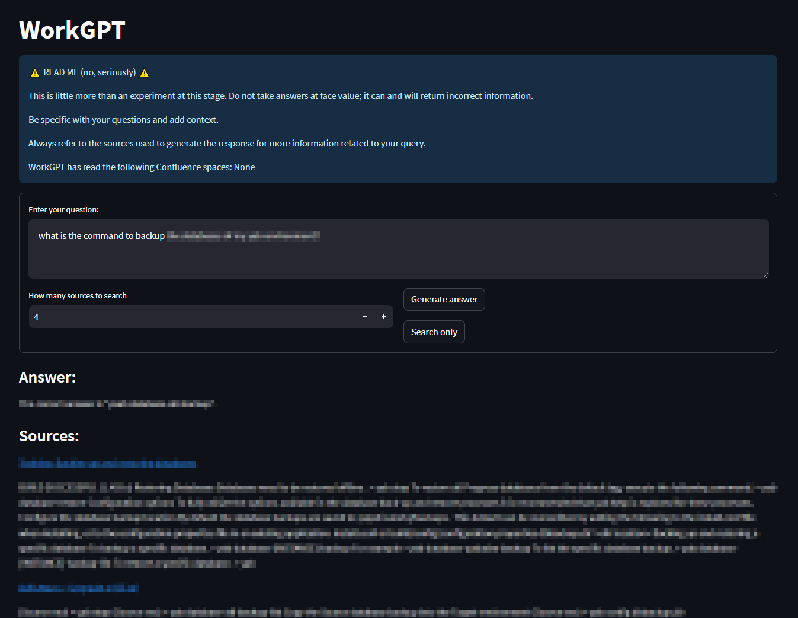

# WorkGPT
QA over Documents pipeline with a focus on privacy. All models and logic run locally. Suitable for use with company data.  
Implemented on LangChain and with a simple Streamlit WebUI.  
Reads from a private Confluence site, calculates embeddings with HuggingFaceEmbeddings and generates responses with the GPT4All LLM.  
Dockerized for easy deployment.  
```bash
$ docker run [...] workgpt 
Error: Please provide a command.
Usage: ./entrypoint.sh <command>
Available commands:
  webui        Runs streamlit webserver
  rebuild-db   Creates a new vector store and loads Confluence pages
  append-db    Appends Confluence pages to existing vector store
  interactive  Runs in interactive mode
```  
Configured via environment variables; see [.env.example](./.env.example).  



---

Pending / TODO:
* Broken concurrency; move to langhcain ts
* Tweak text splitting and chunk sizes
* Test MultiQueryRetriever